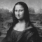

# Da Vinciho poselství

> Před pár měsíci jsem zdědil velice zvláštní věc. Byla mi odkázaná disketa, na které jsem našel tuhle fotografii známého obrazu Mony Lisy od Leonarda da Vinciho.
>
> 
>
> Poslední slova byla *"Na té disketě je ukrytá moudrost od samotného da Vinciho! Já jsem ho nědokázal objevit, ale věřím, že ty to dokážeš! Všechno není černobílé..."*

Vypadá to, že Mona Lisa toho může ukrývat ještě víc, než jsme si mysleli a my teď máme lepší technologii, než kdy dřív. Můžeme programovat v Cčku!

Obrázek je naštěstí ve formátu [.bmp](https://en.wikipedia.org/wiki/BMP_file_format), který je velmi snadný na čtení i bez hlubší znalosti daného formátu. Části, které nás zajímají vypadají uvnitř takhle:


Hlavička:
```
+-------------------+
| Offset od začátku |
+-------------------+
| 0x00              |   ... (pro nás) nedůležité informace ...
| 0x0A              | Offset, na kterém začínají data o pixelech
| 0x0E              |   ... (pro nás) nedůležité informace ...
+-------------------+
```

Potom se přesuňte na offset (viz 0x0A), kde začnete číst data o pixelech:
```
+-------------------+
| offset + 0x00     | Modrá
| offset + 0x01     | Zelená
| offset + 0x02     | Červená
| offset + 0x03     | Alfa (průhlednost)
+-------------------+
```

Podle posledních slov nás zajímají pixely, které nejsou černobílé (neplatí pro ně `red == green == blue`).

Dokážete odhalit, co nám chtěl Leonardo sdělit?

## Přílohy
[> fotka.bmp](fotka.bmp)